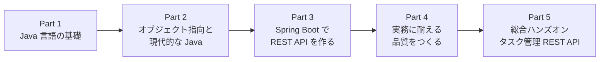
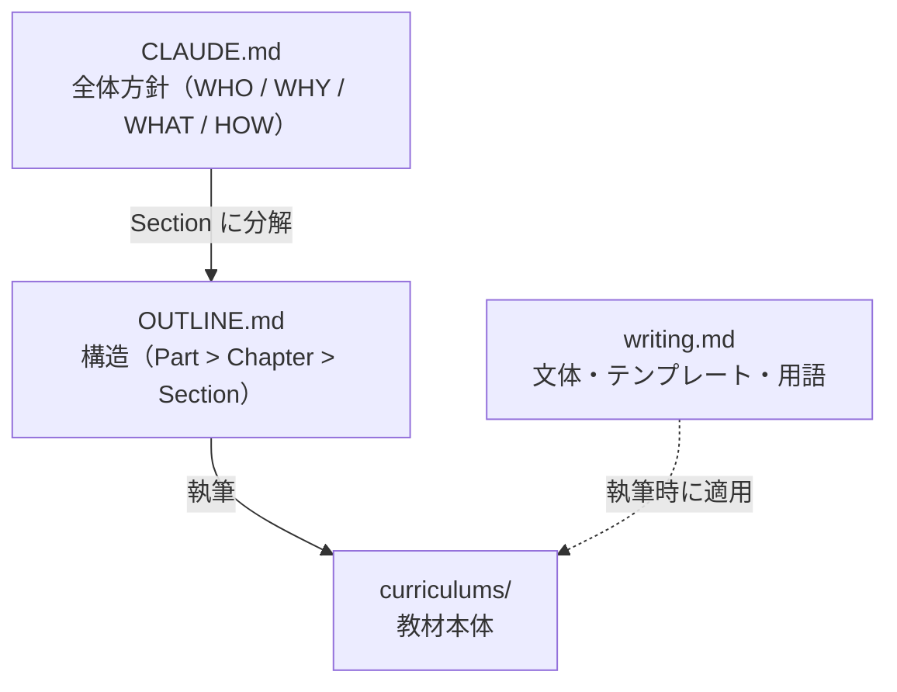

# Laravel 経験者のための Java / Spring Boot バックエンド開発

[](https://github.com/coachtech-material/java-spring-boot-curriculum/actions/workflows/deploy.yml)
[](https://adoptium.net/)
[](https://spring.io/projects/spring-boot)
[](https://www.mysql.com/)

Laravel（PHP）の経験を足がかりに、Java と Spring Boot で **企業の現場に通用する REST API バックエンド** を設計・実装・テストできるようになるための教材です。

> 📖 **公開サイトで読む**: **<https://coachtech-material.github.io/java-spring-boot-curriculum/>**
>
> この教材は MkDocs で Web サイトとして公開しています。検索・ダークモード・コードのコピーが使えるので、学習はこちらが最適です。このリポジトリは教材のソース（Markdown）と執筆・公開の仕組みを管理しています。

---

## この教材について

### 対象読者

Laravel（PHP）で Web アプリケーションを一通り開発した経験を持ち、これから Java / Spring Boot を学ぶ方を対象としています。ルーティング・コントローラ・Eloquent ORM・マイグレーション・バリデーション・認証・REST API・自動テストといった Web 開発の主要素を実務レベルで扱った経験を前提とします。

一方で **Java は未経験でも問題ありません**。すでに持っている「Web 開発の考え方」を活かし、Laravel との対比を中心に Java へ橋渡しします。

### ねらい

これまでメインで扱ってきた Laravel（PHP）に加えて、企業のバックエンド開発で広く使われる Java / Spring Boot を扱えるようになることで、参画できる案件の幅を広げる。それがこの教材のねらいです。

### 修了時のゴール

修了時には、企業に紹介できるジュニアエンジニアとして必要十分な技術力を、行動レベルで身につけています。

- **静的型付け** と **本格的なオブジェクト指向**（継承・インターフェース・抽象クラス・ポリモーフィズム・ジェネリクス）を理解し、設計・読解できる
- **現代的な Java**（record・enum・Optional・ラムダ・Stream）で、不変データ・null 安全・宣言的なコレクション操作を簡潔に書ける
- Spring Boot の **DI コンテナ・アノテーション駆動・オートコンフィギュレーション** の「なぜ動くのか」を自分の言葉で説明できる
- Spring MVC で **REST API** を、Spring Data JPA で **データアクセス層**（リレーション・トランザクション・N+1 対策）を実装できる
- Spring Security で **認証・認可**（JWT 入門を含む）を、JUnit / Mockito / MockMvc で **テスト** を書ける
- 例外設計・ログ・設定の外部化・Docker パッケージングなど、**実務で即必要になる土台** を扱える

総合的な到達点として、**1つの REST API アプリケーションをゼロから設計・実装・テストできる** ことをゴールとします。

---

## カリキュラム構成

全 **5 Part / 18 Chapter / 45 Section**。Part 1 から 4 でコードを示しながら概念を体系的に解説し、Part 5 の総合ハンズオンで一気に作り上げます。

| Part | テーマ | Chapter | Section | 内容 |
|---|---|:---:|:---:|---|
| **Part 1** | Java 言語の基礎 | 3 | 8 | 静的型付け・JVM・基本文法・コレクション・例外処理 |
| **Part 2** | オブジェクト指向と現代的な Java | 4 | 9 | 継承・インターフェース・ポリモーフィズム・record・enum・ジェネリクス・Optional・Stream |
| **Part 3** | Spring Boot で REST API を作る | 5 | 13 | DI コンテナ・Web 層・DTO・バリデーション・Spring Data JPA・サーバーサイドレンダリング入門 |
| **Part 4** | 実務に耐える品質をつくる | 3 | 6 | 認証・認可（JWT 入門）・テスト・例外設計・ログ・設定の外部化・パッケージング |
| **Part 5** | 総合ハンズオン（タスク管理 REST API） | 3 | 9 | 認証付きタスク管理 REST API をゼロから設計・実装・テスト |

**学びの流れ**: 言語に慣れる（P1）→ オブジェクト指向で設計する（P2）→ Spring で API を組む（P3）→ 品質を備える（P4）→ ゼロから作る（P5）。



<details>
<summary>全 18 Chapter の内訳を見る</summary>

| Chapter | タイトル | Section 数 |
|---|---|:---:|
| 1-1 | オリエンテーションと Java という言語 | 3 |
| 1-2 | 基本文法 | 3 |
| 1-3 | コレクションと例外処理 | 2 |
| 2-1 | クラスとカプセル化 | 2 |
| 2-2 | 継承と抽象クラス | 2 |
| 2-3 | インターフェースとポリモーフィズム | 2 |
| 2-4 | 現代的な Java | 3 |
| 3-1 | Spring Boot 入門 | 3 |
| 3-2 | DI コンテナとレイヤードアーキテクチャ | 2 |
| 3-3 | Web 層と REST API の実装 | 3 |
| 3-4 | データアクセス層と Spring Data JPA | 3 |
| 3-5 | サーバーサイドレンダリング入門（Spring MVC + Thymeleaf） | 2 |
| 4-1 | 認証と認可 | 2 |
| 4-2 | テスト | 2 |
| 4-3 | 運用の土台 | 2 |
| 5-1 | 設計とプロジェクト初期化 | 2 |
| 5-2 | 実装 | 5 |
| 5-3 | テストと仕上げ | 2 |

各 Section のゴール・前提・参考資料・Laravel 対比は [`OUTLINE.md`](OUTLINE.md) に記載しています。

</details>

---

## ボリューム

本文は全 45 Section で **合計 約 42 万文字**（424,000 字）。技術書およそ 3 冊分のボリュームです。

| Part | テーマ | 文字数 |
|---|---|---:|
| Part 1 | Java 言語の基礎 | 約 3.9 万字 |
| Part 2 | オブジェクト指向と現代的な Java | 約 6.2 万字 |
| Part 3 | Spring Boot で REST API を作る | 約 14.7 万字 |
| Part 4 | 実務に耐える品質をつくる | 約 6.9 万字 |
| Part 5 | 総合ハンズオン（タスク管理 REST API） | 約 10.9 万字 |
| **合計** | | **約 42 万字** |

---

## 技術スタック

| 領域 | 採用 | 補足 |
|---|---|---|
| 言語 | **Java 21 LTS**（OpenJDK / Eclipse Temurin） | コード例は **17 でも通用する書き方** を基本とし、21 専用機能（仮想スレッド・record パターン等）は使用時に明示 |
| フレームワーク | **Spring Boot 4.0.x** | 現場遭遇率の高い **3.x への読み替え**（Jackson 2・設定差）と **2.x→3.x の javax→jakarta 移行** をコラムで補足 |
| ビルド | **Maven** | Composer の `composer.json` に近い宣言的な `pom.xml` |
| データアクセス | **Spring Data JPA / Hibernate** | Eloquent の知識を足がかりに |
| データベース | **MySQL**（Docker） | Laravel 時代と同じ DBMS |
| セキュリティ | **Spring Security** | 認証・認可、JWT 入門 |
| テスト | **JUnit Jupiter / Mockito / Spring Boot Test（MockMvc）** | Boot 4 の BOM が管理する版に準拠 |
| 環境 | **Docker / Docker Compose**、IntelliJ IDEA | 実装は AI 支援（Claude Code）を前提とする |

> 💡 読者が入る案件は Java / Spring Boot のバージョンがまちまちなので、**学んだ書き方がそのまま現場で通用すること** を最優先しています。バージョン差分は本文を散らかさず、必要な箇所で短いコラムとして補足します。

---

## この教材の特徴

- **全編で Laravel と対比**: 全 Section で PHP / Laravel との対比を織り込み、既習を足がかりに Java の具体（記法・型・作法・差異）へ接続します。
- **概念を主軸に、Why → What → How で解説**: 構文の暗記ではなく「なぜそうなっているか」の理解を最優先します。各 Part / Chapter の冒頭で全体像（地図）を先に示します。
- **必要な情報を省略しない**: 読者の Java 知識はゼロ前提のため、基本文法を含めて Java での具体は省略せず解説します（既習の概念は再入門しません）。
- **ハンズオンは Part 5 に集約**: Part 1 から 4 はコードを示しながら概念を体系的に解説し、実際の構築は総合ハンズオンで一気に行います。
- **AI（Claude Code）活用を前提**: 構文は AI が補う前提で、構造の理解に重きを置きます。

---

## リポジトリ構成

```text
java-spring-boot-curriculum/
├── CLAUDE.md          # 教材の方針（WHO / WHY / WHAT / HOW / MAP）
├── OUTLINE.md         # カリキュラム設計（全 Part / Chapter / Section のゴール・依存）
├── README.md          # このファイル
├── curriculums/       # 教材本体（日本語パス。Part > Chapter > Section）
├── docs/              # 公開サイト（index.md と stylesheets/ は手書き、それ以外は生成物）
├── assets/            # 画像・作図プロンプト
├── scripts/
│   └── build_docs.py  # curriculums/ → docs/ 変換（スラッグ化・リンク / 画像パス書き換え）
├── mkdocs.yml         # MkDocs Material 設定
├── requirements.txt   # サイトビルドの依存
└── .claude/
    ├── rules/writing.md   # 執筆ルール（文体・テンプレート・用語）
    └── skills/            # 執筆・運用スキル（下記）
```

| ファイル | 役割 |
|---|---|
| [`CLAUDE.md`](CLAUDE.md) | 誰に・なぜ・何を・どう教えるか |
| [`OUTLINE.md`](OUTLINE.md) | 各 Section のゴール・種類・順序・依存関係・参考資料・Laravel 対比 |
| [`.claude/rules/writing.md`](.claude/rules/writing.md) | 文体・テンプレート・用語・図表形式 |
| `curriculums/` | 読者に届く教材そのもの |

---

## 教材の執筆・メンテナンス

この教材は Claude Code のスキルで執筆・保守しています。コントリビュートや更新を行う場合の参考にしてください。

### 教材の組み立て方

全体方針（`CLAUDE.md`）を Section 単位の構造（`OUTLINE.md`）へ分解し、執筆ルール（`writing.md`）に沿って教材本体（`curriculums/`）を書きます。



### スキル

| スキル | やること |
|---|---|
| `/setup` | 方針（CLAUDE.md）・構造（OUTLINE.md）・執筆ルール（writing.md）を対話的に決める |
| `/write` | OUTLINE に基づいて Section を執筆する（Part / Chapter / Section 単位、または一括） |
| `/review` | 品質・用語・整合性をレビューする（自動修正はしない） |
| `/check-updates` | 公式ドキュメント・Changelog と照合し、更新が必要な箇所を報告する |
| `/illustrate` | Gemini で概念図を生成し、Section に挿入する |

### 公開フロー

`main` への push で **自動ビルド & デプロイ** されます（`.github/workflows/deploy.yml` が `build_docs.py` → `mkdocs build --strict` → GitHub Pages を実行）。教材を更新するときは `curriculums/` を編集して `main` に push するだけです。

ローカルでプレビューする場合:

```bash
# 依存をインストール
pip install -r requirements.txt

# curriculums/（日本語パス）を docs/（英語スラッグ）へ変換
python scripts/build_docs.py

# ローカルサーバで確認（http://127.0.0.1:8000）
mkdocs serve
```

> 💡 `docs/index.md` と `docs/stylesheets/` は手書きで管理し、`docs/part-*` ・ `docs/assets` ・ `site/` は生成物のため `.gitignore` 対象です。テーマカラーは公式 Java カラー（Java Blue `#007396` / Java Orange `#ED8B00`）を `docs/stylesheets/custom.css` で定義しています。
