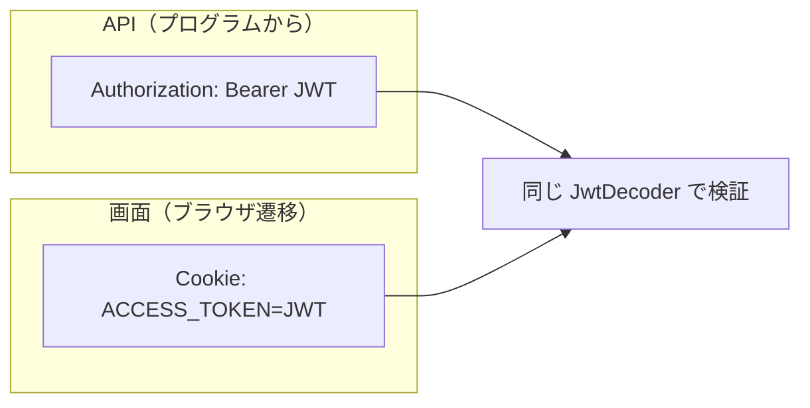

# 5-2-5 タスク一覧画面（Thymeleaf）

📝 **このハンズオンで使う機能**: 画面を返す Spring MVC（3-5-1 で学習）・Thymeleaf テンプレート（3-5-2 で学習）

## 🎯 このセクションで学ぶこと

- `@Controller` と Thymeleaf で、ログイン中ユーザーのタスク一覧を読み取り専用の HTML 画面として表示できる
- 同じデータを「JSON を返す API」と「HTML を返す画面」の両方で扱い、両者の違いを実装で説明できる
- 画面（ブラウザ遷移）では Bearer ヘッダーが使えないことを理解し、Cookie で認証を運ぶ方法を実装できる

画面で認証をどう運ぶかという課題から入り、ログインでの Cookie 発行、1 ルートだけ Cookie で認証する仕組み、`@Controller`、テンプレートへと進みます。

---

## 導入: 同じデータを、画面でも見せる

ここまで作ったタスク一覧は JSON を返す API でした。本セクションでは、同じタスク一覧を **HTML 画面** としても表示します。3-5 で学んだ `@Controller` + Thymeleaf の出番です。主役はあくまで REST API なので、画面は **ログイン中ユーザーのタスク一覧を表示するだけの読み取り専用** に絞ります。作成・編集はしません。

ここで一つ、実装上の壁にぶつかります。API は `Authorization: Bearer <JWT>` ヘッダーでトークンを運んでいました。ところが、ブラウザで `/tasks` を開くという **ページ遷移** では、このヘッダーは自動では飛びません。つまり、同じ JWT 認証の仕組みのままでは「ログイン中のユーザー」を画面側で解決できないのです。この「API と画面で認証の運び方が違う」という事実こそ、JSON API と画面描画型 MVC の違いを体感する、本セクションの核です。

### 🧠 先輩エンジニアの思考プロセス

> 業務系や SIer の案件では、画面描画型の Spring MVC がいまも主流です。私が最初に戸惑ったのが、まさにこの認証の運び方でした。API はヘッダーにトークンを載せればいい。でも、ユーザーがブラウザでリンクをクリックする遷移では、JavaScript を介さない限りヘッダーは付けられません。ここを混同すると「ログインしているはずなのに画面で 401」とハマります。

> 実務での定石は、画面用には Cookie でトークンを運ぶことです。本教材では最小構成として、ログイン時に JWT を `HttpOnly` Cookie にも載せ、画面の 1 ルートだけ Cookie からトークンを読みます。読み取り専用の GET なので、これで十分実用になります。「API はヘッダー、画面は Cookie」と運び方を使い分けるのだ、と腑に落とせば、業務系の案件にもそのまま対応できます。

---

## 📌 実装を始める前の確認

- [ ] 5-2-4 の JWT 認証・認可が動作する（ログインでトークンを取得できる）
- [ ] `AuthController` の `/api/auth/login` が JWT を返す
- [ ] MySQL コンテナが起動している

---

## 🏃 実践: 読み取り専用のタスク一覧画面

### 🏃 Step 1: 画面の認証をどう運ぶか決める

整理すると、課題と方針は次のとおりです。

- **課題**: ブラウザで `/tasks` を開くページ遷移では、`Authorization: Bearer` ヘッダーが飛ばない。だから JWT で「ログイン中のユーザー」を解決できない
- **方針**: ログイン成功時に、JWT を **`HttpOnly` Cookie** にも載せる。画面のルートだけ、その Cookie からトークンを読んで認証する。API はこれまでどおりヘッダーで認証する



### 🏃 Step 2: ログイン時に JWT を Cookie にも載せる

5-2-4 で作ったログインエンドポイントを更新し、トークンを JSON の本文で返すのに加えて、`HttpOnly` Cookie にもセットします。

```java
// メソッドを置き換え: AuthController.java の login（Cookie もセットする版に。追加 import は下の 4 つ。LoginRequest / TokenResponse は 5-2-4 で追加済み）
import jakarta.servlet.http.HttpServletResponse;
import org.springframework.http.HttpHeaders;
import org.springframework.http.ResponseCookie;
import java.time.Duration;

@PostMapping("/login")
public TokenResponse login(@Valid @RequestBody LoginRequest request, HttpServletResponse response) {
    String token = authService.login(request);

    // 画面用に、JWT を HttpOnly Cookie にも載せる
    ResponseCookie cookie = ResponseCookie.from("ACCESS_TOKEN", token)
            .httpOnly(true)          // JavaScript から読めない（XSS 対策）
            .sameSite("Strict")      // 別サイトからのリクエストでは送られない（CSRF 対策）
            .path("/")
            .maxAge(Duration.ofHours(1))
            .build();
    response.addHeader(HttpHeaders.SET_COOKIE, cookie.toString());

    return new TokenResponse(token);   // API 利用者向けに本文でも返す
}
```

💡 **`HttpOnly` と `SameSite`**: `HttpOnly` を付けると Cookie は JavaScript から読めなくなり、XSS でトークンを盗まれにくくなります。`SameSite=Strict` を付けると、別サイト起点のリクエストでは Cookie が送られず、CSRF を抑えられます。本番では HTTPS 前提で `.secure(true)` も付けます（ローカルの http 開発では付けると Cookie がセットされないため、ここでは外しています）。

### 🏃 Step 3: GET のときだけ Cookie からトークンを読む

`oauth2ResourceServer().jwt()` は既定で `Authorization` ヘッダーからトークンを読みます。これに、「ヘッダーが無く、かつ安全な GET のときだけ Cookie からも読む」フォールバックを足します。トークンの取り出し方を決めるのが `BearerTokenResolver` です。`security` パッケージに作ります。

```java
// 新規作成: src/main/java/com/example/taskapp/security/CookieOrHeaderBearerTokenResolver.java
package com.example.taskapp.security;

import jakarta.servlet.http.Cookie;
import jakarta.servlet.http.HttpServletRequest;
import org.springframework.security.oauth2.server.resource.web.BearerTokenResolver;
import org.springframework.security.oauth2.server.resource.web.DefaultBearerTokenResolver;
import org.springframework.stereotype.Component;

@Component
public class CookieOrHeaderBearerTokenResolver implements BearerTokenResolver {

    private final DefaultBearerTokenResolver delegate = new DefaultBearerTokenResolver();

    @Override
    public String resolve(HttpServletRequest request) {
        // ① まず Authorization: Bearer ヘッダー（API はこちら）
        String fromHeader = delegate.resolve(request);
        if (fromHeader != null) {
            return fromHeader;
        }
        // ② ヘッダーが無く、安全な GET のときだけ Cookie から読む（画面用）
        if ("GET".equals(request.getMethod())) {
            Cookie[] cookies = request.getCookies();
            if (cookies != null) {
                for (Cookie cookie : cookies) {
                    if ("ACCESS_TOKEN".equals(cookie.getName())) {
                        return cookie.getValue();
                    }
                }
            }
        }
        return null;
    }
}
```

🔑 **Cookie を読むのは GET だけ**: ②で GET に限っているのが安全上の肝です。もし POST / PUT / DELETE でも Cookie を受け付けると、ブラウザが Cookie を自動送信する性質を突かれ、CSRF で更新系を叩かれる恐れがあります。更新系の API は **ヘッダーのトークンだけ** を受け付けるので、Cookie を使った CSRF では通りません。読み取り専用の GET（画面表示）に限れば、状態を変えないので安全です。

この Resolver を `SecurityConfig` に組み込みます。`filterChain` メソッドを再び置き換えます。5-2-4 の内容に、引数の `bearerTokenResolver` と `.bearerTokenResolver(...)` を足すだけです（`Customizer` / `SessionCreationPolicy` は import 済みなので、新たに追加する import は `CookieOrHeaderBearerTokenResolver` の 1 つです）。

```java
// メソッドを置き換え: SecurityConfig.java の filterChain（5-2-4 の内容に、引数の resolver と .bearerTokenResolver(...) を足す）
import com.example.taskapp.security.CookieOrHeaderBearerTokenResolver;

@Bean
public SecurityFilterChain filterChain(HttpSecurity http,
                                       CookieOrHeaderBearerTokenResolver bearerTokenResolver) throws Exception {
    http
        .authorizeHttpRequests(auth -> auth
            .requestMatchers("/api/auth/**", "/login.html").permitAll()   // 登録・ログイン API と、ログインページ（Step 6 で作る /login.html）は公開
            .anyRequest().authenticated()       // /api/tasks も /tasks（画面）も認証必須
        )
        .sessionManagement(s -> s.sessionCreationPolicy(SessionCreationPolicy.STATELESS))
        .csrf(csrf -> csrf.disable())
        .oauth2ResourceServer(oauth2 -> oauth2
            .bearerTokenResolver(bearerTokenResolver)   // ヘッダー or Cookie からトークンを取る
            .jwt(Customizer.withDefaults()));
    return http.build();
}
```

これで、画面ルート `/tasks` も API と同じ `JwtDecoder` でトークンを検証できます。トークンの運び方（ヘッダー / Cookie）が違うだけで、検証の仕組みは 1 つに保てます。

### 🏃 Step 4: 画面を返す @Controller を作る

3-5-1 で学んだとおり、画面を返すのは `@Controller`（`@RestController` ではありません）です。`Model` にデータを載せ、ビュー名を返します。まず、テンプレートに渡すための **エンティティ** を取得するメソッドを `TaskService` に足します。

```java
// 既存に追記: TaskService.java（findMyTaskEntities メソッドをクラス内に。Task / List は import 済み）

@Transactional(readOnly = true)
public List<Task> findMyTaskEntities(String username) {
    return taskRepository.findByUsernameWithTags(username);
}
```

```java
// 新規作成: src/main/java/com/example/taskapp/controller/TaskViewController.java
package com.example.taskapp.controller;

import com.example.taskapp.entity.Task;
import com.example.taskapp.service.TaskService;
import org.springframework.security.core.Authentication;
import org.springframework.stereotype.Controller;
import org.springframework.ui.Model;
import org.springframework.web.bind.annotation.GetMapping;

import java.util.List;

@Controller   // @RestController ではない（戻り値はビュー名）
public class TaskViewController {

    private final TaskService taskService;

    public TaskViewController(TaskService taskService) {
        this.taskService = taskService;
    }

    @GetMapping("/tasks")
    public String list(Authentication authentication, Model model) {
        List<Task> tasks = taskService.findMyTaskEntities(authentication.getName());
        model.addAttribute("tasks", tasks);                       // "tasks" でテンプレートへ渡す
        model.addAttribute("username", authentication.getName());
        return "tasks/list";   // src/main/resources/templates/tasks/list.html
    }
}
```

💡 **画面にはエンティティ、API には DTO**: API の `TaskController` は DTO（`TaskResponse`）を返しました。一方この画面では、エンティティ（`Task`）をそのまま `Model` に載せています。Thymeleaf はテンプレートの中で `${task.title}` のように getter（`getTitle()` / `isDone()`）を呼んで値を取り出すため、getter を持つエンティティが扱いやすいのです。エンティティは **サーバ内でテンプレートに描画されるだけ** でクライアントには JSON として出ていかないので、3-3-2 で注意した「エンティティを API でそのまま返さない」とは状況が異なります。ただし、テンプレートに出すフィールドは必要なものだけにします（ここでは `title` / `done` / `dueDate`）。

### 🏃 Step 5: Thymeleaf テンプレートを作る

3-5-2 で学んだ構文で、一覧テンプレートを作ります。`src/main/resources/templates/tasks/list.html` です。`th:each` で繰り返し、`th:if` / `th:unless` で空のときの出し分けをします。

```html
<!-- 新規作成: src/main/resources/templates/tasks/list.html -->
<!DOCTYPE html>
<html xmlns:th="http://www.thymeleaf.org">
<head>
  <meta charset="UTF-8">
  <title>タスク一覧</title>
</head>
<body>
  <h1>タスク一覧</h1>
  <p><span th:text="${username}">ユーザー</span> さんのタスク</p>

  <p th:if="${#lists.isEmpty(tasks)}">タスクはまだありません。</p>

  <table th:unless="${#lists.isEmpty(tasks)}">
    <thead>
      <tr><th>#</th><th>タイトル</th><th>状態</th><th>期限</th></tr>
    </thead>
    <tbody>
      <tr th:each="task, stat : ${tasks}">
        <td th:text="${stat.count}">1</td>
        <td th:text="${task.title}">サンプルタスク</td>
        <td th:text="${task.done} ? '完了' : '未完了'">未完了</td>
        <td th:text="${task.dueDate}">2026-06-30</td>
      </tr>
    </tbody>
  </table>

  <div th:replace="~{fragments/layout :: copyright}"></div>
</body>
</html>
```

共通フッターはフラグメントに切り出します。`src/main/resources/templates/fragments/layout.html` です。

```html
<!-- 新規作成: src/main/resources/templates/fragments/layout.html -->
<!DOCTYPE html>
<html xmlns:th="http://www.thymeleaf.org">
<body>
  <footer th:fragment="copyright">
    <p>&copy; 2026 タスク管理アプリ</p>
  </footer>
</body>
</html>
```

💡 **Laravel との対応**: `th:each` は Blade の `@foreach`、`th:if` / `th:unless` は `@if` / `@unless`、`th:fragment` + `th:replace` は `@include` に相当します（3-5-2）。`resources/views/tasks/index.blade.php` が `src/main/resources/templates/tasks/list.html` に変わっただけ、と捉えてください。

### 🏃 Step 6: ログインページを置いてブラウザで確認する

画面で確認するには、ブラウザに `ACCESS_TOKEN` Cookie をセットする必要があります（`curl` でログインしてもブラウザの Cookie には入りません）。一番素直なのは、**`localhost:8080` 上で動く小さなログインページ** を 1 枚置くことです。`src/main/resources/static/` に置いた HTML は、Spring Boot が `http://localhost:8080/<ファイル名>` で配信します（`/login.html` は Step 3 の `SecurityConfig` で公開済み）。

```html
<!-- 新規作成: src/main/resources/static/login.html -->
<!DOCTYPE html>
<html lang="ja">
<head>
  <meta charset="UTF-8">
  <title>ログイン</title>
</head>
<body>
  <h1>ログイン</h1>
  <form id="loginForm">
    <p><input name="username" placeholder="ユーザー名" value="alice"></p>
    <p><input name="password" type="password" placeholder="パスワード" value="password123"></p>
    <button type="submit">ログイン</button>
  </form>
  <p id="message"></p>

  <script>
    document.getElementById('loginForm').addEventListener('submit', async (event) => {
      event.preventDefault();
      const form = event.target;
      const res = await fetch('/api/auth/login', {     // 同一オリジンなので CORS は起きない
        method: 'POST',
        headers: { 'Content-Type': 'application/json' },
        body: JSON.stringify({ username: form.username.value, password: form.password.value })
      });
      if (res.ok) {
        location.href = '/tasks';                       // 成功 → HttpOnly Cookie がセットされ、タスク一覧へ
      } else {
        document.getElementById('message').textContent = 'ログインに失敗しました（ステータス ' + res.status + '）';
      }
    });
  </script>
</body>
</html>
```

アプリを再起動し（`Ctrl + C` → `./mvnw spring-boot:run`）、ブラウザで `http://localhost:8080/login.html` を開きます。フォームは `alice` / `password123` が入った状態なので、そのまま「ログイン」を押すと、`HttpOnly` Cookie がセットされて `/tasks` に移動し、`alice` のタスク一覧が HTML で表示されます（5-2-4 で alice のタスクを作っていれば、それが並びます。別のパスワードで登録していたら、その値に直してください）。同じデータを、API では `curl ... /api/tasks`（JSON）で、画面では `/tasks`（HTML）で見られることを確認してください。

> 💡 **コンソールに `fetch` を貼り付ける方法を採らない理由**: 認証必須の `/` を直接開くと、ボディの無い `401` が返って Chrome は `chrome-error://` のエラーページを表示します。そこから開発者ツールのコンソールで相対 URL を `fetch` しても `localhost:8080` には飛ばず、絶対 URL にすると今度はエラーページが別オリジン（`null`）扱いになり CORS で弾かれます（`@CrossOrigin(origins = "*")` を足せば通りますが、全オリジン許可はセキュリティ上避けたい）。さらに新しい Chrome では、コンソールへの貼り付け自体が `allow pasting` の確認でブロックされます。**同一オリジンの 200 ページ（このログインページ）から叩けば**、これらは一切起きません。

> ⚠️ **よくあるエラー**: `/tasks` を開くと `401` になる。
>
> **原因**: ブラウザに `ACCESS_TOKEN` Cookie がセットされていません（ログインページでログインしていない、または Cookie の有効期限切れ）。
>
> **対処法**: もう一度 `http://localhost:8080/login.html` からログインしてから `/tasks` を開きます。

<!-- TODO: 画像追加 - ブラウザで /tasks を開いたタスク一覧画面（タイトル・状態・期限のテーブル） -->

---

## ✅ 完成チェックリスト

- [ ] ログイン時に JWT を `HttpOnly` + `SameSite` Cookie にも載せた
- [ ] `CookieOrHeaderBearerTokenResolver` で、GET のときだけ Cookie からトークンを読むようにした
- [ ] `SecurityConfig` に Resolver を組み込んだ
- [ ] `@Controller` の `TaskViewController` を作り、`Model` にエンティティを載せてビュー名を返した
- [ ] `templates/tasks/list.html` と `templates/fragments/layout.html` を作った
- [ ] `static/login.html`（ログインページ）を作り、`SecurityConfig` で `/login.html` を公開した
- [ ] `login.html` からログイン → `/tasks` でタスク一覧が HTML 表示されることを確認した

---

## ✨ まとめ

- 同じタスク一覧を、API は JSON（`@RestController` + DTO）、画面は HTML（`@Controller` + Thymeleaf + エンティティ）で返す。変換するものが Jackson か Thymeleaf かの違い（3-5-1）
- ブラウザのページ遷移では `Authorization` ヘッダーが飛ばないので、ログイン時に JWT を `HttpOnly` Cookie にも載せ、画面ルートはそこから読む。検証は同じ `JwtDecoder` で 1 本化できる
- Cookie からの読み取りは **安全な GET だけ** に限り、更新系はヘッダーのみ受け付けることで CSRF を防ぐ。`SameSite` も併用する
- Thymeleaf は getter で値を取るので、画面にはエンティティを渡すのが自然（サーバ内で描画され、クライアントには HTML だけが出ていく）

📚 **使った概念の復習**: 3-5-1（画面を返す Spring MVC）/ 3-5-2（Thymeleaf テンプレート）

---

【Chapter 5-2 の振り返り】本章では、空のプロジェクトから動くタスク管理 API を一気に組み上げました。データ層（エンティティ・リポジトリ）から始め、Service と Controller で CRUD の縦串を通し、バリデーションと統一エラー、N+1 対策を入れ、Spring Security でユーザー登録・ログインを実装し、JWT によるステートレス認証と「自分のタスクのみ」の認可まで到達しました。最後に、同じデータを Thymeleaf の画面でも見せ、API と画面描画型 MVC の認証の運び方の違いを実装で確かめました。Part 1〜4 で学んだ概念が、1 つの動くアプリとしてつながったはずです。

次の Chapter 5-3 では、この API の振る舞いを **テスト** で保証し、起動・動作確認・片付けまでを行って教材を締め括ります。まず 5-3-1 で、Service の単体テスト・Controller の `MockMvc` テスト・統合テストを書き、「変更しても壊れていない」ことを自動で確かめられるようにします。
